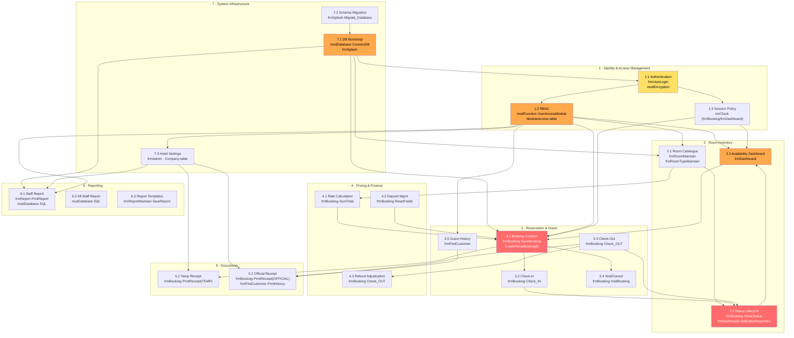

I'll perform targeted LSP analysis on the core modules to accurately map capability boundaries before generating the document.I now have comprehensive data from prior stages and targeted lookups. I'll generate the capability map.

---

# Business Capability Map — Star Hotel VB6
**Project:** Star Hotel VB6 · Legacy VB6 Hotel Room Reservation System
**Prepared for:** Modernization Wave Planning
**Stage:** 3 of N — Enterprise Architect Deliverable

---

## 1. Capability Hierarchy

```
STAR HOTEL SYSTEM
├── 1. Identity & Access Management (IAM)
│   ├── 1.1 User Authentication
│   ├── 1.2 Role-Based Access Control (RBAC)
│   └── 1.3 Session & Security Policy
│
├── 2. Room Inventory Management
│   ├── 2.1 Room Catalogue & Type Configuration
│   ├── 2.2 Room Status Lifecycle
│   └── 2.3 Real-Time Availability Dashboard
│
├── 3. Reservation & Guest Management
│   ├── 3.1 Booking Creation & ID Generation
│   ├── 3.2 Guest Check-In
│   ├── 3.3 Guest Check-Out
│   ├── 3.4 Booking Void / Cancellation
│   └── 3.5 Guest History & Search
│
├── 4. Pricing & Financial Calculation
│   ├── 4.1 Stay Duration & Rate Calculation
│   ├── 4.2 Deposit Management
│   └── 4.3 Refund Adjudication
│
├── 5. Receipt & Document Generation
│   ├── 5.1 Temporary Receipt
│   └── 5.2 Official Receipt
│
├── 6. Reporting & Analytics
│   ├── 6.1 Shift / Staff Booking Report
│   ├── 6.2 All-Staff Summary Report
│   └── 6.3 Report Template Management
│
├── 7. System Configuration & Infrastructure
│   ├── 7.1 Database Connection & Bootstrapping
│   ├── 7.2 Database Schema Migration
│   └── 7.3 Company / Hotel Settings
```

---

## 2. Capability Detail Cards

### 1.1 User Authentication
| Attribute | Detail |
|---|---|
| **Legacy Owner** | `Form/frmUserLogin.frm` · `cmdOK_Click`, `lblCopyright_Click` |
| **Support Modules** | `Module/modEncryption.bas` → `GoldFishEncode()` · `Module/modDatabase.bas` → `NeedChangePassword()` |
| **Data Owned** | `UserData` (UserID, UserPassword, Salt, LoginAttempts, Active, ChangePassword, Idle) |
| **Data Shared** | `UserGroup` (read-only for group label) |
| **Upstream Deps** | 7.1 DB must be live; `Config.txt` path resolved |
| **Downstream Deps** | 1.2 RBAC (UserGroup resolved post-login) · 1.3 Session (Idle set) · **all** guarded capabilities |
| **Coupling** | **Tight** — global vars `gstrUserID`, `gintUserGroup`, `gintUserIdle` written here, read everywhere |
| **Change Frequency** | Stable; contains `BR-08` backdoor (technical debt) |
| **Key Risks** | Plaintext admin shortcut (`BR-08`); custom XOR cipher `GoldFishEncode`; no token/session abstraction |

### 1.2 Role-Based Access Control
| Attribute | Detail |
|---|---|
| **Legacy Owner** | `Module/modFunction.bas` → `UserAccessModule()` · `Module/modGlobal.bas` (MOD_* constants 1–11) |
| **Data Owned** | `ModuleAccess` (Group1–Group4 boolean columns per module ID) |
| **Upstream Deps** | 1.1 (UserGroup set); `ModuleAccess` table |
| **Downstream Deps** | Every guarded form: `frmDashboard`, `frmBooking`, `frmReport`, `frmPrint`, `frmUserMaintain`, `frmRoomMaintain`, `frmAdmin` |
| **Coupling** | **Very Tight** — 14 call-sites across 7 forms; constant IDs hard-coded in `modGlobal.bas` |
| **Change Frequency** | Stable schema; MOD_BOOKING_VOID commented out (`BR-05`) — indicates recent change churn |
| **Key Risks** | Any new module requires coordinated change across `modGlobal`, `ModuleAccess` table, and every calling form |

### 1.3 Session & Security Policy
| Attribute | Detail |
|---|---|
| **Legacy Owner** | `frmBooking.frm:tmrClock_Timer`, `frmDashboard.frm:tmrClock_Timer` · `frmDialog.frm` (idle prompt) |
| **Data Owned** | `UserData.Idle` (persisted); `gintUserIdle`, `intTick` (runtime globals) |
| **Upstream Deps** | 1.1 Authentication (Idle value injected into global) |
| **Downstream Deps** | 3.x Booking (timer runs inside frmBooking); 2.3 Dashboard (timer runs inside frmDashboard) |
| **Coupling** | Tight — timer logic duplicated in two forms sharing same globals |
| **Key Risks** | `BR-10` clamps out-of-range values; duplicate timer logic is a defect surface |

### 2.1 Room Catalogue & Type Configuration
| Attribute | Detail |
|---|---|
| **Legacy Owner** | `Form/frmRoomMaintain.frm` → `SaveRecord()` · `Form/frmRoomTypeMaintain.frm` → `SaveRoomType()` |
| **Data Owned** | `Room` (RoomID, Level, Type, Status, …) · `RoomType` (TypeID, TypeName, Price) |
| **Upstream Deps** | 7.1 DB; 1.2 RBAC (MOD_MAINTAIN_ROOM) |
| **Downstream Deps** | 2.2 Status lifecycle; 2.3 Dashboard; 3.1 Booking; 4.1 Pricing |
| **Coupling** | Moderate — consumed widely via SQL joins but tables are cleanly owned |
| **Change Frequency** | Stable (hotel layout rarely changes) |

### 2.2 Room Status Lifecycle
| Attribute | Detail |
|---|---|
| **Legacy Owner** | `frmBooking.frm` → `ShowStatus()`, `Check_IN()`, `Check_OUT()`, `VoidBooking()` · `frmDashboard.frm` → `SetButtonProperties()`, `AlertBooking()` |
| **Data Owned** | `Room.Status` (Open/Booked/Occupied/Housekeeping/Maintenance/Void) |
| **Upstream Deps** | 2.1 Room catalogue; 3.1–3.4 Reservation operations |
| **Downstream Deps** | 2.3 Dashboard colours; 5.x Receipts (status gate) |
| **Coupling** | **Tight** — status transitions split across two forms with no shared service layer; `BR-11–15` |
| **Key Risks** | Concurrent-update risk (no locking visible in ADO OLEDB layer); orphan status on void |

### 2.3 Real-Time Availability Dashboard
| Attribute | Detail |
|---|---|
| **Legacy Owner** | `Form/frmDashboard.frm` → `ShowSummary1–5()`, `cmdUnit_Click()`, `AlertBooking()` |
| **Data Owned** | Read-only projection of `Room`, `Booking` |
| **Upstream Deps** | 2.1 Room config; 2.2 Status; 1.2 RBAC (MOD_DASHBOARD); 1.3 Session timer |
| **Downstream Deps** | Launches 3.1 Booking; 2.1 Room Maintain; 6.x Reports; 1.2 Access Control admin |
| **Coupling** | **Tight** — dashboard is the shell/hub; all navigation originates here; `gintUserGroup` gated menus inline |
| **Key Risks** | Monolithic form with 1,700+ lines; blinking alert logic is polling-based (timer) |

### 3.1 Booking Creation & ID Generation
| Attribute | Detail |
|---|---|
| **Legacy Owner** | `frmBooking.frm` → `SaveBooking()`, `CreateTempBookingID()`, `SumTotal()`, `cboStayDuration_Click()` |
| **Data Owned** | `Booking` (ID, RoomID, GuestName, Passport, CheckIn, CheckOut, StayDuration, Deposit, Payment, Status, Temp, CreatedBy/Date, LastModifiedBy) |
| **Upstream Deps** | 2.1 Room config (price lookup); 1.1 Auth (`gstrUserID` stamped); 4.1 Pricing |
| **Downstream Deps** | 3.2 Check-In; 3.3 Check-Out; 3.4 Void; 5.1 Temporary Receipt; 6.x Reports |
| **Coupling** | **Very Tight** — `frmBooking` owns 2,600+ lines mixing UI, business logic, DB access, and receipt printing |
| **Change Frequency** | **Volatile** — most feature-dense file; all pricing, checkout date, deposit rules co-located |
| **Key Risks** | No separation of concerns; any change risks regression across booking, check-in, check-out, receipt; `BR-23` date logic is complex |

### 3.2 Guest Check-In
| Attribute | Detail |
|---|---|
| **Legacy Owner** | `frmBooking.frm` → `Check_IN()` |
| **Data Owned** | Writes `Booking.Status = Occupied`, `Payment`, `CheckInActual` |
| **Upstream Deps** | 3.1 Booking must exist; 4.2 Deposit + SubTotal must match payment (`BR-13`) |
| **Downstream Deps** | 2.2 Room status → Occupied; 5.x Receipt |
| **Coupling** | Tight — embedded in `frmBooking`; payment validation rule `IsPaid` inline |

### 3.3 Guest Check-Out
| Attribute | Detail |
|---|---|
| **Legacy Owner** | `frmBooking.frm` → `Check_OUT()` |
| **Data Owned** | Writes `Booking.Status = Checked Out`, `Refund`, `CheckOutActual` |
| **Upstream Deps** | 3.2 Check-In must have occurred; 4.3 Refund logic (post-14:00 → no refund `BR-14`) |
| **Downstream Deps** | 2.2 Room → Housekeeping (`BR-15`); 5.2 Official Receipt |
| **Coupling** | Tight — time-of-day business rule embedded in form handler |

### 3.4 Booking Void / Cancellation
| Attribute | Detail |
|---|---|
| **Legacy Owner** | `frmBooking.frm` → `VoidBooking(plngBookingID)` (public) · partial references in `frmAdmin.frm` (commented out) |
| **Data Owned** | `Booking.Active = False`, `Room.Status = Void` |
| **Upstream Deps** | 3.1 Booking; 1.2 RBAC (MOD_BOOKING_VOID — currently commented out) |
| **Coupling** | **Loose** — `VoidBooking` is `Public`, called externally; RBAC check removed |
| **Key Risks** | Missing access control check is an active security gap |

### 3.5 Guest History & Search
| Attribute | Detail |
|---|---|
| **Legacy Owner** | `Form/frmFindCustomer.frm` → `PrintHistory()` |
| **Data Owned** | Read from `Booking` (filtered by Passport/Contact); joins `UserData`, `UserGroup` |
| **Upstream Deps** | 1.2 RBAC (MOD_FIND_CUSTOMER); 3.1 Booking data |
| **Downstream Deps** | 5.x Receipt reprint |
| **Coupling** | Moderate — read-only query; cross-joins `UserData` for staff attribution |

### 4.1 Stay Duration & Rate Calculation
| Attribute | Detail |
|---|---|
| **Legacy Owner** | `frmBooking.frm` → `SumTotal()`, `cboStayDuration_Click()` |
| **Data Owned** | Derived only; reads `RoomType.Price` |
| **Rules** | `SubTotal = Nights × Price` (`BR-18`); checkout noon rule (`BR-23`) |
| **Coupling** | Tightly embedded in `frmBooking` |

### 4.2 Deposit Management
| Attribute | Detail |
|---|---|
| **Legacy Owner** | `frmBooking.frm` → `ResetFields()`, `SumTotal()` |
| **Data Owned** | `Booking.Deposit` |
| **Rules** | Default hardcoded `20.00` (`BR-20`); `TotalDue = SubTotal + Deposit` (`BR-19`) |
| **Key Risks** | Hardcoded default is a business rule masquerading as UI state |

### 4.3 Refund Adjudication
| Attribute | Detail |
|---|---|
| **Legacy Owner** | `frmBooking.frm` → `Check_OUT()` |
| **Rules** | After 14:00 checkout → `Refund = 0` (`BR-14`); `OfficialTotal = Payment - Refund` (`BR-22`) |
| **Data Owned** | `Booking.Refund` |

### 5.1 Temporary Receipt
| Attribute | Detail |
|---|---|
| **Legacy Owner** | `frmBooking.frm` → `PrintReceipt("TEMPORARY")` |
| **Support** | Crystal Reports via `CRAXDRT.Application`; report file in `Report/` directory |
| **Data Consumed** | `Booking`, `Company` (JOIN) |
| **Upstream Deps** | 3.1 Booking; 7.1 Crystal Reports engine initialised at startup |
| **Coupling** | Tight to Crystal Reports COM dependency; SQL for receipt embedded in `frmBooking` |

### 5.2 Official Receipt
| Attribute | Detail |
|---|---|
| **Legacy Owner** | `frmBooking.frm` → `PrintReceipt("OFFICIAL")` · `frmFindCustomer.frm` → `PrintHistory()` |
| **Data Consumed** | `Booking`, `Company` |
| **Key Risks** | Receipt re-print uses same Crystal Reports COM stack; no PDF export abstraction |

### 6.1–6.3 Reporting & Analytics
| Attribute | Detail |
|---|---|
| **Legacy Owner** | `Form/frmReport.frm` → `PrintReport(lngReportID)` · `Form/frmPrint.frm` · `Form/frmReportMaintain.frm` → `SaveReport()` · `Module/modDatabase.bas` (report SQL queries, lines ~770–940) |
| **Data Consumed** | `Booking`, `Company`; parameterised by staff/date range |
| **Upstream Deps** | 1.2 RBAC (MOD_REPORT_LIST, MOD_REPORT_PRINT, MOD_REPORT_EXPORT, MOD_REPORT_EDIT, MOD_REPORT_EDIT_EXPERT) |
| **Downstream Deps** | None — terminal capability |
| **Coupling** | Report SQL in `modDatabase.bas` (shared module); Crystal Reports COM for rendering; 5 access levels |
| **Change Frequency** | Volatile — `BR-27` expert edit mode (`frmReportMaintain`) suggests active report customisation |
| **Key Risks** | Crystal Reports `.rpt` files in `Report/` dir are binary; hard to version-control or test |

### 7.1 Database Connection & Bootstrapping
| Attribute | Detail |
|---|---|
| **Legacy Owner** | `Module/modDatabase.bas` → `ConnectDB()` · `Form/frmSplash.frm` → `Timer1_Timer` |
| **Data Owned** | `Config.txt` (path + filename on lines 0/1); `ADODB.Connection` global |
| **Upstream Deps** | None — root capability |
| **Downstream Deps** | All other capabilities |
| **Coupling** | **Very Tight** — single global ADO connection object shared across all forms |
| **Key Risks** | `Microsoft.Jet.OLEDB.4.0` provider (32-bit only); single `.mdb` file; no connection pooling |

### 7.2 Database Schema Migration
| Attribute | Detail |
|---|---|
| **Legacy Owner** | `frmSplash.frm` → `Migrate_Database()`, `Update_Database(dblVersion)` |
| **Data Owned** | `Company.DatabaseVersion` field drives version detection |
| **Coupling** | Moderate — only invoked at startup; isolated in splash form |
| **Key Risks** | Version comparison is floating-point (`dblVersion`); migration SQL is ad-hoc DDL in code |

### 7.3 Company / Hotel Settings
| Attribute | Detail |
|---|---|
| **Legacy Owner** | `frmAdmin.frm` → `cmdOK_Click()` |
| **Data Owned** | `Company` table (hotel name, address, DBVersion, etc.) |
| **Upstream Deps** | 1.2 RBAC (MOD_ACCESS_CONTROL) |
| **Downstream Deps** | 5.x Receipts (company name/address joined); 6.x Reports |
| **Coupling** | Moderate — `Company` table is JOIN-ed into every receipt and report query |

---

## 3. Dependency Graph



> 🔴 **Red** = Very High coupling / migration risk · 🟠 **Orange** = High coupling · 🟡 **Yellow** = Moderate coupling

---

## 4. Stage 2 BDD Coverage Cross-Reference

| Capability | BDD Features | Coverage Status | Gap |
|---|---|---|---|
| 1.1 User Authentication | F2 (full — 7 scenarios) | ✅ Full | `BR-08` shortcut scenario present |
| 1.2 RBAC | F9 (3 scenarios) | ⚠️ Partial | No scenario for MOD_BOOKING_VOID disabled; no combo role tests |
| 1.3 Session Timeout | F3 (3 scenarios) | ✅ Adequate | Edge: timer duplicate in two forms not tested |
| 2.1 Room Catalogue | — | ❌ No coverage | No BDD for room/type CRUD |
| 2.2 Status Lifecycle | F4, F5, F6, F7 (distributed) | ⚠️ Partial | Housekeeping → Open transition not explicitly covered |
| 2.3 Availability Dashboard | F4 (4 scenarios) | ✅ Adequate | Blink/alert edge cases covered via `BR-25` |
| 3.1 Booking Creation | F5 (5 scenarios) | ✅ Full | Temp ID race-condition not tested |
| 3.2 Check-In | F6 (4 scenarios) | ✅ Full | — |
| 3.3 Check-Out | F7 (5 scenarios incl. noon rule) | ✅ Full | Concurrent checkout not tested |
| 3.4 Void / Cancellation | F12 (2 scenarios) | ⚠️ Partial | Missing RBAC bypass scenario (commented-out guard) |
| 3.5 Guest History | — | ❌ No coverage | No BDD for guest search / reprint |
| 4.1 Rate Calculation | F5 (within booking) | ✅ Adequate | — |
| 4.2 Deposit Management | F5, F6 | ✅ Adequate | Hardcoded default `20.00` has no dedicated test |
| 4.3 Refund Adjudication | F7 | ✅ Full | — |
| 5.1 Temp Receipt | F8 (2 scenarios) | ✅ Adequate | — |
| 5.2 Official Receipt | F8 (2 scenarios) | ✅ Adequate | — |
| 6.1–6.3 Reporting | F10 (3 scenarios) | ⚠️ Partial | Report template edit (frmReportMaintain) not covered |
| 7.1 DB Bootstrap | F1 (4 scenarios) | ✅ Full | — |
| 7.2 Schema Migration | F1 (1 scenario) | ⚠️ Partial | Individual DDL migration steps not verified |
| 7.3 Hotel Settings | — | ❌ No coverage | No BDD for Company record management |

**Coverage Summary:** 11 ✅ Full/Adequate · 6 ⚠️ Partial · 3 ❌ No coverage

---

## 5. Modernization Waves

### Wave 0 — Foundation (Pre-Migration Enablers)
> *Unlock the ability to migrate anything else. No business-visible change.*

| Capability | Rationale |
|---|---|
| 7.1 DB Bootstrap | Replace Jet/OLEDB with modern DB driver; externalize `Config.txt` to env config |
| 7.2 Schema Migration | Replace ad-hoc DDL in `frmSplash` with Flyway/Liquibase; remove float version comparison |
| 7.3 Hotel Settings | Extract `Company` table to dedicated config service — consumed by receipts and reports |

**Risk:** Low business impact; high infra risk. Rollback: keep legacy `.mdb` alongside new DB during dual-write.

---

### Wave 1 — Identity & Access
> *Decouple the security perimeter. All other migrations depend on a stable auth/authz layer.*

| Capability | Rationale |
|---|---|
| 1.1 User Authentication | Replace `GoldFishEncode` with bcrypt/Argon2; eliminate `BR-08` backdoor; introduce JWT or session token |
| 1.2 RBAC | Extract `ModuleAccess` + `UserAccessModule()` to a permissions service; normalise MOD_* constants to a permission registry |
| 1.3 Session Policy | Centralise idle-timeout as middleware; remove duplicated timer logic from two forms |

**Risk:** Medium. If RBAC service is wrong, all guarded capabilities break. Mitigation: shadow-run against legacy access table for 1 sprint.

---

### Wave 2 — Room Inventory
> *Stable, low-volatility data; establishes the master data foundation for reservations.*

| Capability | Rationale |
|---|---|
| 2.1 Room Catalogue & Types | Simple CRUD; no cross-cutting dependencies; clear data ownership |
| 2.2 Status Lifecycle | Formalise state machine (Open/Booked/Occupied/Housekeeping/Maintenance/Void) as an explicit domain service |
| 2.3 Availability Dashboard | Migrate after 2.1 + 2.2; replace polling-timer with WebSocket push or server-sent events |

**Risk:** Low-Medium. Status lifecycle is split across two legacy forms; formal state machine eliminates the defect surface.

---

### Wave 3 — Reservation Core *(Revenue-Critical)*
> *Highest business criticality. Migrate after auth + room inventory are stable.*

| Capability | Rationale |
|---|---|
| 4.1 Rate Calculation | Must be a pure service (no UI side-effects) before bookings move |
| 4.2 Deposit Management | Extract hardcoded `20.00` default to hotel configuration |
| 3.1 Booking Creation | Migrate `SaveBooking` + `CreateTempBookingID`; replace temp-record ID strategy with DB sequence |
| 3.2 Check-In | Simple state transition; depends on 3.1 and 4.x being clean |
| 3.4 Void / Cancellation | Re-attach RBAC guard (fix security gap from commented-out `MOD_BOOKING_VOID`) |

**Risk:** **High.** `frmBooking` is 2,600+ lines; all pricing, lifecycle, and receipt logic co-located. Strangler-fig pattern recommended: new booking API behind feature flag, legacy form as fallback.

---

### Wave 4 — Check-Out & Financial Closure
> *Depends on Wave 3 booking being stable; contains time-sensitive business rules.*

| Capability | Rationale |
|---|---|
| 4.3 Refund Adjudication | Isolate post-14:00 rule as a pure function with explicit test |
| 3.3 Guest Check-Out | State transition + refund; depends on 4.3 |
| 3.5 Guest History & Search | Read-only; low risk; unlocks receipt reprint |

**Risk:** Medium. The 14:00 deposit-no-refund rule (`BR-14`) is a hard financial rule; must have contract test before cutover.

---

### Wave 5 — Documents & Reporting
> *Terminal capabilities; no downstream dependents; can migrate last.*

| Capability | Rationale |
|---|---|
| 5.1 Temporary Receipt | Replace Crystal Reports COM with PDF generation (e.g. iText, Puppeteer, JasperReports) |
| 5.2 Official Receipt | Same renderer; share template engine with 5.1 |
| 6.1 Staff Booking Report | Replace `modDatabase` report SQL with reporting service; maintain existing query semantics |
| 6.2 All-Staff Summary Report | Same service; add date-range filter UI modernisation |
| 6.3 Report Template Management | Replace Crystal Reports `.rpt` binary templates with version-controlled report definitions |

**Risk:** Medium. Crystal Reports COM is the single hardest technology to replace. Mitigation: evaluate SSRS, JasperReports, or observable PDF micro-service. Binary `.rpt` files must be reverse-engineered before Wave 5 begins.

---

## 6. Risk Register

| Wave | Risk | Likelihood | Impact | Mitigation | Rollback |
|---|---|---|---|---|---|
| W0 | Jet OLEDB data type incompatibilities during migration | Medium | High | Schema audit + type mapping document before migration | Dual-read from `.mdb` + new DB |
| W0 | Float version comparison drift (`dblVersion`) | Low | Medium | Replace with semver string comparison immediately | N/A (startup-only) |
| W1 | `GoldFishEncode` replacement breaks existing password hashes | High | Critical | Hash upgrade: on next login, re-hash with bcrypt; support dual-hash period | Keep legacy hash path behind feature flag |
| W1 | RBAC extraction misses a call-site | Medium | High | `lsp_references` audit on `UserAccessModule` (14 confirmed call-sites) | Shadow-mode: log denials vs. legacy for 1 sprint |
| W1 | `BR-08` admin backdoor not removed (security) | High | Critical | Block must be in Wave 1 scope | N/A — remove, no rollback |
| W2 | Status machine formalisation leaves orphan states | Medium | Medium | Map all 6 states to transitions table; reject unknown transitions at API layer | Legacy form remains live until Wave 3 |
| W3 | `CreateTempBookingID` race condition in new concurrent API | Medium | High | Replace with DB sequence / UUID; remove temp-record pattern | Legacy single-user booking remains |
| W3 | Hardcoded deposit `20.00` baked into client expectations | Medium | Low | Expose as hotel config param in Wave 0 Company settings | Default to `20.00` if unset |
| W4 | 14:00 refund rule clock manipulation / timezone edge | Low | High | Unit tests with explicit UTC+local offset; contract test required | Manual override flag for manager |
| W5 | Crystal Reports `.rpt` reverse-engineering cost underestimated | High | Medium | Spike in Wave 4 to enumerate all report fields; schedule 1 extra sprint buffer | Keep Crystal Reports COM on migration host during parallel run |
| W5 | Report SQL in `modDatabase.bas` contains implicit join semantics | Medium | Medium | Run legacy reports against both engines for 2 weeks before cutover | Query dual-run comparison script |

---

## 7. Coupling Heat Map Summary

| Capability | Coupling Level | Migration Risk |
|---|---|---|
| 3.1 Booking Creation | 🔴 Very Tight | Critical |
| 2.2 Room Status Lifecycle | 🔴 Very Tight | Critical |
| 1.2 RBAC | 🟠 Tight (14 call-sites) | High |
| 2.3 Availability Dashboard | 🟠 Tight (shell/hub) | High |
| 7.1 DB Bootstrap (global ADO connection) | 🟠 Tight | High |
| 1.1 Authentication (global vars) | 🟡 Moderate-Tight | Medium |
| 1.3 Session Policy (duplicated timers) | 🟡 Moderate-Tight | Medium |
| 6.1–6.2 Reporting (SQL in modDatabase) | 🟡 Moderate | Medium |
| 5.1–5.2 Receipts (Crystal Reports COM) | 🟡 Moderate | Medium |
| 2.1 Room Catalogue | 🟢 Loose | Low |
| 3.4 Void / Cancellation | 🟢 Loose | Low |
| 3.5 Guest History | 🟢 Loose | Low |
| 7.2 Schema Migration | 🟢 Loose | Low |
| 7.3 Hotel Settings | 🟢 Loose | Low |