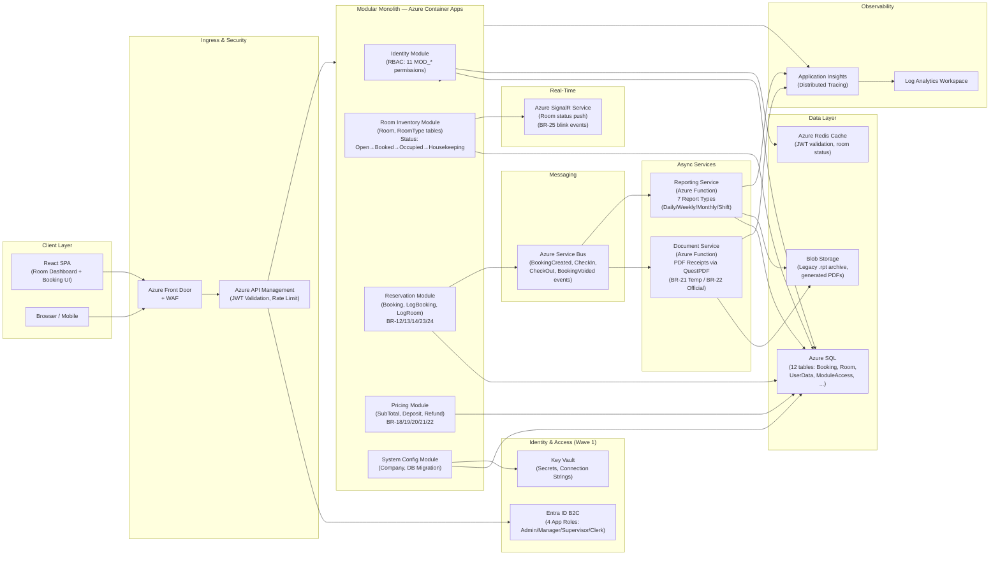
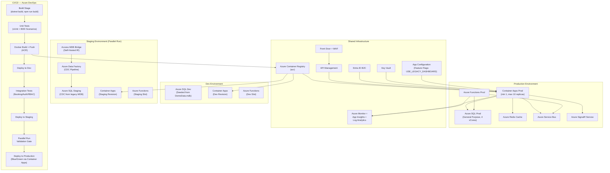

# Star Hotel VB6 — Modernization Approach
## Stage 4: Target Architecture & Migration Strategy

---

## 1. TARGET ARCHITECTURE

### 1.1 Architecture Pattern: Modular Monolith → Phased Microservices

**Chosen Pattern: Modular Monolith (initial target) with event-driven seams**

**Justification:**
- The legacy system has 12 database tables, ~61 rooms, a 4-tier RBAC system, and a small staff team. This is **not** inherently a microservices-scale problem.
- Stage 3 identified 7 capability groups with tight coupling (e.g., global vars `gstrUserID`, `gintUserGroup`, `gintUserIdle` written in login, read in every form). Decomposing prematurely would create chatty service calls with no throughput benefit.
- A **modular monolith** with clearly bounded internal modules, shared via explicit interfaces, allows:
  - Zero-friction refactoring from the VB6 big-ball-of-mud
  - A single deployable that can later be split at proven seams
  - Async events (Azure Service Bus) emitted for audit/reporting workloads — the only justified async boundary
- **Future escape hatch**: Reporting (Capability 6) and Document Generation (Capability 5) are read-heavy, Crystal Reports–dependent, stateless — these are split as independent Azure Functions from Wave 1.

### 1.2 Service / Module Boundaries (aligned to Stage 3 capability map)

| Module | Capability Group | Key Tables | Notes |
|--------|-----------------|------------|-------|
| **Identity Service** | 1.1–1.3 (IAM) | `UserData`, `UserGroup`, `ModuleAccess` | Replaces GoldFishEncode + global vars with Entra ID tokens + JWT claims |
| **Room Inventory Module** | 2.1–2.3 | `Room`, `RoomType` | Owns room lifecycle state machine (Open→Booked→Occupied→Housekeeping→Open) |
| **Reservation Module** | 3.1–3.5 | `Booking`, `LogBooking`, `LogRoom` | Core transactional domain; owns booking ID generation (BR-24), temp record pattern |
| **Pricing Module** | 4.1–4.3 | Read from `Room`, `RoomType`; writes `Booking.SubTotal/Deposit/Refund` | Pure calculation logic; stateless; embeds BR-18–BR-23 |
| **Document Service** | 5.1–5.2 | Read `Booking`, `Company` | Azure Function; replaces Crystal Reports .rpt files; generates PDF receipts |
| **Reporting Service** | 6.1–6.3 | Read `Booking`, `WeeklyBooking`, `Company`, `Report` | Azure Function; replaces Crystal Reports dashboard; SQL → PDF/XLSX |
| **System Config Module** | 7.1–7.3 | `Company`, DB migration routines | Startup bootstrap; company settings; schema migrations via EF Core |

### 1.3 Technology Stack

| Layer | Choice | Rationale |
|-------|--------|-----------|
| **Language** | C# 12 / .NET 8 | Industry standard, strong typing, replaces VB6 COM; excellent Azure SDK support |
| **API Framework** | ASP.NET Core 8 Minimal APIs + controllers | Thin, fast; familiar to .NET ecosystem; easy OpenAPI generation |
| **Frontend** | React 18 + TypeScript + Vite | Replaces VB6 WinForms; SPA fits dashboard real-time update pattern; colour-coded room grid maps naturally to React state |
| **Real-time dashboard** | Azure SignalR Service | Replaces `tmrClock_Timer` polling in `frmDashboard`; push room-status blink events (BR-25) |
| **Database** | Azure SQL (General Purpose tier) | Direct schema lift from MS Access (Jet SQL); all 12 tables migrate with minimal change; familiar SQL dialect |
| **ORM** | Entity Framework Core 8 | Code-first migrations replace `modDatabase.bas CreateDB()`; strong typing over raw ADO recordsets |
| **Auth** | Microsoft Entra ID (B2C tenant) + JWT | Replaces `GoldFishEncode` XOR cipher (BR-04), hardcoded admin backdoor (BR-08); preserves 4-group RBAC via Entra ID app roles |
| **Secrets** | Azure Key Vault | Replaces `gstrPassword` / `Config.txt` plain-text DB password |
| **Messaging** | Azure Service Bus (Standard tier) | Booking-created / check-in / check-out events consumed by Reporting and Document services; replaces synchronous Crystal Reports calls |
| **PDF Generation** | QuestPDF (open-source, .NET native) | Replaces CRAXDRT Crystal Reports COM dependency; no per-seat license; generates Temporary Receipt (BR-21) and Official Receipt (BR-22) |
| **Hosting** | Azure Container Apps | Serverless containers; scales to zero overnight (hotel has low off-peak traffic); no AKS complexity justified at this scale |
| **CI/CD** | Azure DevOps Pipelines + ACR | Replaces manual xcopy/publish from VB6 IDE |
| **Monitoring** | Application Insights + Log Analytics | Replaces `LogErrorText` / `LogErrorDB` file-based logging |
| **Cache** | Azure Redis Cache (Basic C1) | Session token validation cache; room status cache for dashboard reads |

### 1.4 API Design & Contract Strategy

**Protocol: REST over HTTPS** — justified because:
- All clients are browser-based (React SPA); no binary performance requirement ruling out REST
- gRPC is unnecessary at this traffic volume
- GraphQL adds query flexibility not required given the bounded, well-understood queries already in `modDatabase.bas`

**Contract Strategy:**
- OpenAPI 3.0 specs generated from ASP.NET Core Swagger middleware, published to API Management
- Azure APIM acts as the single ingress: enforces JWT validation, rate limiting, and routes to Container Apps
- Versioning: URL path prefix `/api/v1/` — simple, explicit, no content-negotiation complexity
- All booking write operations emit a CloudEvent via Service Bus; consumers are idempotent (BookingID is globally unique, BR-24)
- **Breaking change policy**: additive-only changes to v1 contracts; new capabilities increment to v2

---

## 2. ARCHITECTURE DIAGRAM
*(See `architectureMermaid` field)*

---

## 3. MIGRATION STRATEGY

### Wave 1 — Foundation & Identity (Capabilities 1.x, 7.x)
**Target Capabilities:** User Authentication, RBAC, Session Policy, System Configuration
**Source Evidence:** `frmUserLogin.frm`, `modGlobal.bas` (11 MOD_* constants), `modEncryption.bas`

**Pattern: Big Bang (contained)**
- Justification: The authentication layer is entirely self-contained in `frmUserLogin.frm` + `modEncryption.bas`. It has no customer-facing API to strangle. The GoldFishEncode XOR cipher (BR-04) and hardcoded backdoor (BR-08) are active security liabilities that must be removed atomically — a strangler would leave the vulnerability live.
- Entra ID B2C tenant configured with 4 app roles mapping to UserGroup 1–4 (`Administrator`, `Manager`, `Supervisor`, `Clerk`)
- `ModuleAccess` table seeded as Entra ID role-permission matrix; `UserAccessModule()` logic re-implemented as a .NET policy handler

**Data Migration:**
- ETL: Export `UserData` from Access MDB → Azure SQL `Users` table
- Passwords: Cannot migrate hashes (GoldFishEncode is proprietary XOR). Force `ChangePassword = True` for all users → Entra ID self-service password reset flow on first login (maps to existing BR-07 force-change mechanism)
- Salt and UserPassword columns archived to `_legacy_UserData` and dropped post-cutover

**Cutover Criteria:**
- [ ] All 4 user groups authenticate successfully via Entra ID token in staging
- [ ] JWT claims map correctly to all 11 MOD_* permission constants
- [ ] Login lockout after 3 attempts verified (BDD: F2, Scenario: 3-strike lockout)
- [ ] Zero `LoginAttempts` regression in smoke tests
- [ ] BR-08 backdoor absent (pen-test scan on new auth service)

**Rollback Plan:**
- Azure SQL connection string in Key Vault rolled back to Access ODBC bridge via Azure SQL MI
- Entra ID app registration disabled; legacy VB6 EXE repointed to original MDB via Config.txt
- Maximum rollback window: 2 hours (password cache TTL)

---

### Wave 2 — Room Inventory & Dashboard (Capabilities 2.x)
**Target Capabilities:** Room Catalogue, Room Status Lifecycle, Real-Time Dashboard
**Source Evidence:** `frmDashboard.frm` (61-room grid, `SetButtonProperties`, `AlertBooking`), `frmRoomMaintain.frm`, `frmRoomTypeMaintain.frm`

**Pattern: Strangler Fig**
- The VB6 dashboard polls DB every second via `tmrClock_Timer` (BR-09). The React SPA + SignalR replacement can be deployed alongside the legacy system.
- Room status write path remains in legacy until Wave 3 (Reservation). Dashboard reads can be switched to the new API without touching the booking write path.

**Data Migration:**
- **Dual-write**: When a VB6 booking write occurs, an Azure Logic App trigger (Access MDB file-change webhook via polling) mirrors the `Room.RoomStatus` change to Azure SQL
- `Room` and `RoomType` tables: one-time ETL via Azure Data Factory pipeline (12 rooms in demo; up to ~61 in production)
- Room status state machine encoded as EF Core value object with explicit transition guards (BR-11)

**Cutover Criteria:**
- [ ] React dashboard renders all configured rooms with correct colour coding in staging
- [ ] Status blink logic fires correctly for overdue check-in/check-out (BDD: F4, AlertBooking scenario)
- [ ] Maintenance rooms show as non-bookable (BR-16)
- [ ] 99th-percentile dashboard load < 500 ms on 61 rooms
- [ ] SignalR push latency < 2 s for status change events

**Rollback Plan:**
- Feature flag `USE_LEGACY_DASHBOARD=true` in App Configuration reverts UI to VB6 WinForms client
- Dual-write Logic App continues until Wave 3 cutover; no data loss path

---

### Wave 3 — Reservation & Guest Management (Capabilities 3.x, 4.x)
**Target Capabilities:** Booking creation, check-in, check-out, void, pricing calculation
**Source Evidence:** `frmBooking.frm` (SaveBooking, Check_IN, Check_OUT, VoidBooking, SumTotal, CreateTempBookingID), `frmCustomer.frm`

**Pattern: Parallel Run**
- Booking is the highest-risk capability: handles money, room state transitions, and receipt generation
- Both legacy VB6 and new API accept writes for 2-week parallel period; staff validate outputs match
- BookingID sequence must be shared: Azure SQL SEQUENCE object initialized to `MAX(ID)+1000` from legacy MDB to prevent collision

**Data Migration:**
- **CDC (Change Data Capture)**: Azure Data Factory with Self-Hosted Integration Runtime connected to Access MDB via ODBC; captures `Booking` inserts/updates every 60 seconds → Azure SQL
- `LogBooking` and `LogRoom` tables migrated via full ETL before cutover, then CDC
- Temp booking pattern (BR-24): replicated as a DB-level reservation using `BEGIN TRANSACTION` + sequence allocation, replacing the `Temp=TRUE` insert hack
- `WeeklyBooking` aggregate table: recalculated from `Booking` history via Azure Data Factory pipeline

**Cutover Criteria:**
- [ ] Parallel run: 100 consecutive bookings match between legacy and new system
- [ ] Pricing calculation: SubTotal, Deposit, TotalDue match for all room types (BR-18–BR-20)
- [ ] Check-out after 2 PM sets Refund=0 (BR-14) — automated BDD test
- [ ] Check-in payment validation (BR-13) blocks under-payment in API
- [ ] BookingID 6-digit format preserved (BR-24)
- [ ] Room status transitions complete end-to-end: Open→Booked→Occupied→Housekeeping (BR-11)
- [ ] Zero orphaned `Temp=TRUE` records after 24-hour soak test

**Rollback Plan:**
- APIM policy routes `/api/v1/bookings` back to legacy VB6 thin-API wrapper (Azure Function calling ODBC)
- CDC pipeline re-syncs Azure SQL → MDB for any bookings created in new system during rollback window
- Maximum safe rollback window: 48 hours (before WeeklyBooking aggregate diverges)

---

### Wave 4 — Receipts, Reporting & Decommission (Capabilities 5.x, 6.x)
**Target Capabilities:** Temporary Receipt, Official Receipt, all 7 report types, admin config
**Source Evidence:** `frmBooking.frm` (PrintReceipt TEMPORARY/OFFICIAL, BR-21/22), `frmReport.frm`, `Report` table with 7 embedded SQL queries, `frmAdmin.frm`

**Pattern: Big Bang (low risk)**
- Crystal Reports (.rpt files) have no user-facing API; they are invoked synchronously from VB6 forms. Once Wave 3 is live, the new Document Service and Reporting Service are the only consumers.
- The 7 Crystal Reports SQL queries are fully documented in `modDatabase.bas CreateSampleData()` — they translate directly to parameterized Dapper queries in the Reporting Service.

**Data Migration:**
- `Report` table configuration migrated to Azure SQL as seed data
- Report SQL templates: `$UserID$` and `$BookingID$` placeholder tokens replaced by parameterized query pattern
- Crystal Reports .rpt files archived to Blob Storage cold tier (compliance/audit)
- `WeeklyBooking` table becomes a materialized view in Azure SQL

**Cutover Criteria:**
- [ ] All 7 report types render correctly (Daily, Weekly, Monthly Booking; Weekly Chart; Shift by User; Shift All Users; Official Receipt Reprint)
- [ ] Temporary Receipt matches BR-21 (SubTotal = Payment - Deposit)
- [ ] Official Receipt matches BR-22 (Total = Payment - Refund)
- [ ] PDF output passes pixel-diff test vs Crystal Reports baseline screenshots
- [ ] Legacy MDB file connection string removed from Key Vault
- [ ] VB6 binary decommission sign-off by hotel manager

**Rollback Plan:**
- Crystal Reports .rpt files remain accessible in Blob Storage for 90 days
- APIM mock endpoint can redirect report requests to a containerized VB6-era reporting VM (cold standby) for maximum 14 days

---

## 4. INFRASTRUCTURE DIAGRAM
*(See `infraMermaid` field)*

---

## 5. TRADEOFF ANALYSIS

### Decision 1: Modular Monolith vs. Microservices
| | Option A: Modular Monolith | Option B: Full Microservices |
|---|---|---|
| **Pros** | Simple deployment, low latency between modules, easier transaction management (booking + room status must be atomic per BR-12) | Independent scaling, team autonomy |
| **Cons** | Single deployable unit; harder to scale individual bottlenecks | 7+ services for a ~5-staff hotel app; distributed transaction complexity for booking→room state (Saga pattern overkill); high operational overhead |
| **Recommendation** | **Modular Monolith** | Rejected — the system's transactional integrity requirements (BR-12, BR-13, BR-14 require atomic booking+room state updates) are better served by in-process calls |

### Decision 2: Azure SQL vs. Cosmos DB
| | Option A: Azure SQL | Option B: Cosmos DB |
|---|---|---|
| **Pros** | Direct schema lift from MS Access Jet SQL; strong ACID transactions; EF Core first-class support; familiar SQL for all 7 report queries | Globally distributed, schema-flexible |
| **Cons** | Vertical scale limit (mitigated by General Purpose tier) | Document model mismatch for relational booking+room joins; no native ACID multi-doc transactions without SDK complexity; higher cost at this scale |
| **Recommendation** | **Azure SQL** — all 12 tables are relational with foreign key semantics; the existing report queries use JOINs and aggregates that map directly |

### Decision 3: Crystal Reports vs. QuestPDF
| | Option A: QuestPDF (.NET native) | Option B: SSRS | Option C: Keep Crystal Reports |
|---|---|---|---|
| **Pros** | Open-source, no license cost, code-as-design, CI/CD-testable, cross-platform | Enterprise feature set | Zero rewrite |
| **Cons** | Template migration effort (~7 reports) | Heavy infrastructure, Windows-only agent | COM dependency, Windows-only, no cloud hosting path, license cost |
| **Recommendation** | **QuestPDF** — 7 reports with known SQL queries (all documented in `modDatabase.bas`) are low migration effort; Crystal Reports COM is incompatible with Container Apps |

### Decision 4: React SPA vs. Blazor
| | Option A: React + TypeScript | Option B: Blazor Server |
|---|---|---|
| **Pros** | Largest ecosystem; colour-coded 61-room grid maps to React state naturally; SignalR client library mature | .NET all-the-way; VB6 devs may prefer C# |
| **Cons** | Separate tech stack from backend | SignalR dependency on persistent connections; less suitable for hotel with potential flaky internet |
| **Recommendation** | **React** — the dashboard real-time requirement (BR-25 blink logic) needs robust WebSocket handling; React + Azure SignalR Service is the proven pattern |

### Decision 5: Entra ID vs. Custom Auth
| | Option A: Entra ID B2C | Option B: ASP.NET Core Identity |
|---|---|---|
| **Pros** | Eliminates GoldFishEncode vulnerability (BR-04), admin backdoor (BR-08), and lockout management code; MFA for free; audit logs | Full control; simpler migration of existing password hashes |
| **Cons** | Cannot migrate existing password hashes (GoldFishEncode is proprietary XOR — no reverse migration) | Must implement lockout (BR-02), force-change (BR-07), group management manually |
| **Recommendation** | **Entra ID B2C** — forced password reset on first login is acceptable (maps to existing BR-07 mechanism); eliminates 3 active security CVEs |

---

## 6. NON-FUNCTIONAL REQUIREMENTS

### Performance Targets
| Scenario | Target | Rationale |
|----------|--------|-----------|
| Dashboard load (61 rooms) | < 500 ms P99 | VB6 rendered locally; cloud adds network RTT |
| Booking save (API) | < 800 ms P95 | Includes Azure SQL write + Service Bus publish |
| Receipt PDF generation | < 3 s P95 | Async Azure Function; user sees spinner |
| Report generation (monthly) | < 10 s P95 | Historical query; acceptable for manager use |
| Auth token validation | < 50 ms P99 | Redis cache of JWT validation results |

### Scalability Approach
- **Container Apps**: min 1 replica, max 10; scale rule on HTTP request queue depth
- **Azure SQL**: General Purpose, 4 vCores; upgrade path to Business Critical if IOPS demand grows
- **Azure Redis**: Basic C1 (250 MB); upgrade to Standard C1 for HA if occupancy grows beyond single hotel
- **Service Bus**: Standard tier (no auto-inflate needed at this volume)
- The hotel's natural traffic pattern is bursty at check-in/out times (morning 11 AM, afternoon 2 PM per BR-14/BR-23); Container Apps handles this via rapid scale-out

### Security Architecture
- **Entra ID B2C**: Replaces GoldFishEncode + salt (BR-04). 4 app roles: `Hotel.Administrator`, `Hotel.Manager`, `Hotel.Supervisor`, `Hotel.Clerk`
- **Azure WAF (via App Gateway)**: OWASP CRS 3.2 ruleset; protects APIM and Container Apps
- **Key Vault**: Stores Azure SQL connection string, Service Bus connection, SignalR connection, JWT signing keys. VB6 `Config.txt` pattern eliminated.
- **TLS 1.3**: Enforced at App Gateway; internal Container Apps traffic over mTLS via Dapr sidecar (optional, Wave 4)
- **RBAC least privilege**: Each module permission maps to a fine-grained Entra ID app role; `MOD_ACCESS_CONTROL` (ID 11) restricted to Group 1 (Administrator) only — matching legacy `ModuleAccess` seed data
- **Audit log**: All booking writes publish to Service Bus → Log Analytics workspace (replaces `LogBooking` / `LogRoom` tables as primary audit trail)
- **DDoS Protection**: Standard tier on VNet (hotel reservation system is internet-accessible)

### Observability Strategy
- **Application Insights**: Distributed tracing across Container Apps and Azure Functions; custom events for `BookingCreated`, `CheckIn`, `CheckOut`, `BookingVoided`
- **Log Analytics Workspace**: Central sink for Container Apps logs, Azure SQL query insights, Auth sign-in logs
- **Azure Monitor Alerts**:
  - Booking failure rate > 1% → PagerDuty
  - Room status stuck in `Housekeeping` > 4 hours → ops ticket (BR-11 lifecycle violation)
  - Auth lockout spike (> 5 lockouts/minute) → security alert
- **Custom Dashboard**: Azure Workbook showing occupancy rate, daily revenue, check-in/out queue length — replaces Crystal Reports weekly booking graph
- **Health probes**: `/health/live` and `/health/ready` on all Container Apps; checked every 30 s

---

## 7. DEPLOYMENT DIAGRAM
*(See `deployMermaid` field)*

## Architecture Diagram

## Infrastructure Diagram

## Deployment Diagram

```mermaid
flowchart LR
  subgraph Source["Source Control"]
    Git["GitHub\nstar-hotel-vb6 fork\n(modernised branch)"]
  end

  subgraph Build["Build Stage"]
    DotnetBuild["dotnet build\n.NET 8 solution"]
    NpmBuild["npm run build\nReact SPA (Vite)"]
    Tests["xUnit Tests\n+ BDD Scenarios\n(F1–F12 coverage)"]
    SAST["SAST Scan\n(no GoldFishEncode,\nno hardcoded creds BR-08)"]
  end

  subgraph Package["Package Stage"]
    DockerAPI["Docker Build\nAPI Container Image"]
    DockerFunc["Docker Build\nFunction App Image"]
    PushACR["Push to ACR\n(tagged: sha + semver)"]
  end

  subgraph DeployDev["Deploy: Dev"]
    DevRevision["Container Apps\nDev Revision"]
    SmokeTest["Smoke Tests\n(Auth, Room Status,\nBooking CRUD)"]
  end

  subgraph DeployStaging["Deploy: Staging (Parallel Run)"]
    StagRevision["Container Apps\nStaging Revision"]
    CDCValidation["CDC Sync Check\n(Booking count match\nLegacy vs New)"]
    ParallelGate["Parallel Run Gate\n100 bookings match\nPricing delta = 0"]
  end

  subgraph DeployProd["Deploy: Production"]
    Canary["Canary: 10% Traffic\n(Container Apps traffic split)"]
    CanaryMetrics["Monitor:\nError rate < 0.5%\nP95 latency < 800ms"]
    FullProd["Promote: 100% Traffic\n(Blue revision retired)"]
    Rollback["Rollback Gate\n(revert traffic split\nto previous revision)"]
  end

  subgraph DNS["DNS & Routing"]
    FrontDoor["Azure Front Door\nhotel.example.com"]
    APIM["API Management\napi.hotel.example.com/v1"]
  end

  Git --> DotnetBuild
  Git --> NpmBuild
  DotnetBuild --> Tests
  NpmBuild --> Tests
  Tests --> SAST
  SAST --> DockerAPI
  SAST --> DockerFunc
  DockerAPI --> PushACR
  DockerFunc --> PushACR
  PushACR --> DevRevision
  DevRevision --> SmokeTest
  SmokeTest -->|Pass| StagRevision
  StagRevision --> CDCValidation
  CDCValidation --> ParallelGate
  ParallelGate -->|Pass| Canary
  Canary --> CanaryMetrics
  CanaryMetrics -->|Healthy| FullProd
  CanaryMetrics -->|Unhealthy| Rollback
  FullProd --> FrontDoor
  FrontDoor --> APIM
```
